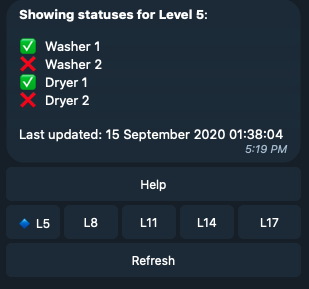

# NUSCollegeLaundryBot
Telegram BOT interface for the Laundry Machine Bot Project; 
 made with python-telegram-bot wrapper;
 made for RC4 by RC4Space

# The Bot
## Interface
Instant status for each laundry machine.


Click on a level to inspect that level's washing status

## Getting Started
1. Clone this repository to your computer.

2. Install python. Then run the following in your terminal.
```
pip install -r requirements.txt
```

3. Setup your VS Code or any IDE with `python 3.0`.

4. Create a telegram bot using thr botfather. Refer [here](https://core.telegram.org/bots#:~:text=for%20existing%20ones.-,Creating%20a%20new%20bot,mentions%20and%20t.me%20links.).

5. Set the environment variable `RC4LAUNDRYBOT_TOKEN` to be your telegram bot token you received from BotFather. Refer [here](https://www.twilio.com/blog/2017/01/how-to-set-environment-variables.html) to see how to do it, depends on your operating system!

6. Run your python code. Enter the following in your terminal.
```
python laundrybot.py
```

# Contributors
- Cai Peng Fei
- Ryo Armanda
- Ivander Jonathan
- Timotius Jason
- Bui Quang Huy